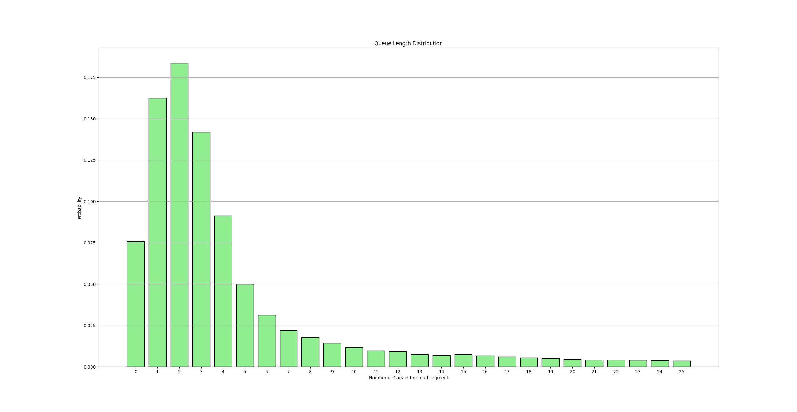
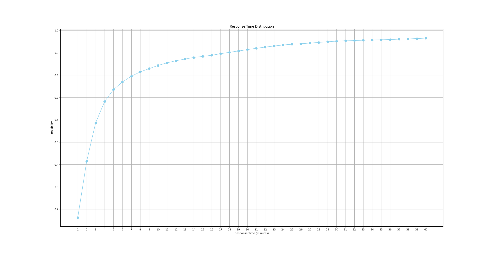
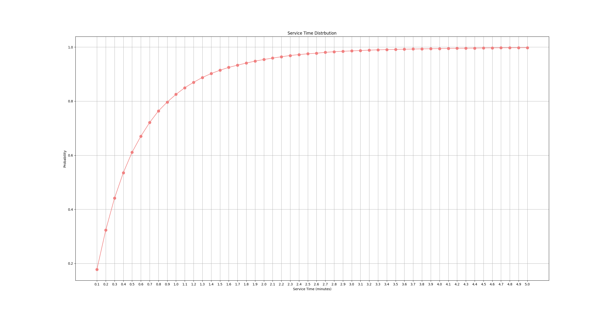

# Basic Performance Indices and Workloads
---
The enclosed files [Logger1.csv](Logger1.csv) and [Logger2.csv](Logger2.csv) are two log files taken from a sensor
monitoring the flow of cars in a traffic road section. Cars first pass through the first sensor, then through the
second. The road segment is single lane, so no overtake is possible. The value is expressed in minutes.
___
Using this data, compute:

- [X] Arrival rate and throughput (expressed in [cars/min.]) 
  - **1.5693 cars/min**
- [X] Average inter-arrival time (expressed in [min.]) 
  - **0.6370 min**
- [X] Utilization 
  - **92.41%**
- [X] Average Service Time (expressed in [min.]) 
  - **0.5889 min**
- [X] Average Number of Jobs 
  - **10.6820 jobs**
- [X] Average Response Time (expressed in [min.]) 
  - **6.8068 min**
- [X] Draw the distribution of the number of cars in the road segment (from 0 to 25)
    - 
- [X] Draw the response time distribution (between 1 and 40 minutes, with a granularity of 1 min.)
    - 
- [X] Draw the service time distribution (between 0.1 and 5 minutes, with a granularity of 0.1 minutes)
    - 
