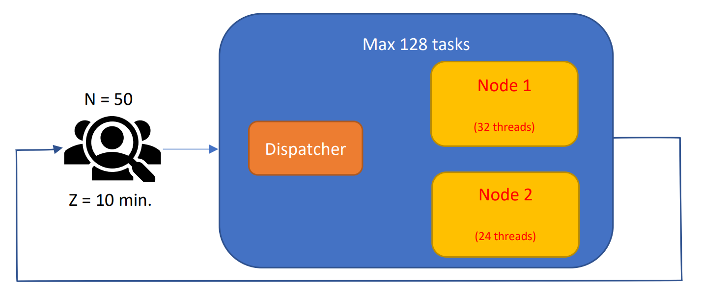
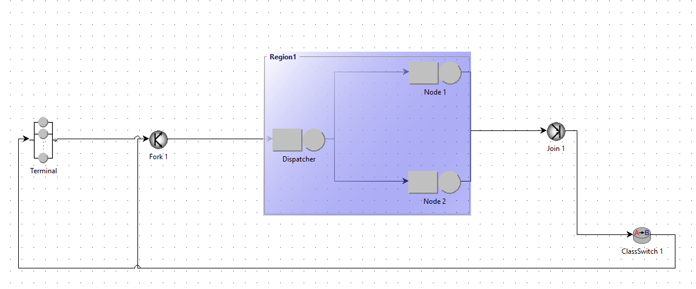

# Performance Evaluation of a Spark System
___

### Overview

This report provides a performance evaluation of a Spark system composed of three stages, each parallelizable on a different number of tasks. A **dispatcher** assigns tasks to two computing nodes, using a *join the shortest queue* approach. Once all tasks of a stage complete, the next stage begins. After all three stages finish, the job completes and the user examines the results before submitting another request after a **10-minute** think time. 

The system allows up to **128 tasks** in execution at once (including the dispatcher and nodes). Each computing node supports a number of concurrent tasks (threads) and has different execution speeds for each stage. The table below summarizes these details:

| **Node**        | **Threads** | **Stage 1** | **Stage 2** | **Stage 3** |
|-----------------|------------:|------------:|------------:|------------:|
| **Node 1**      |          32 | 10 ms       | 20 ms       | 15 ms       |
| **Node 2**      |          24 | 12 ms       | 22 ms       | 18 ms       |

The dispatcher requires an average of **2 ms** to assign a task. The queuing discipline is **Processor Sharing**, and once 128 tasks are in execution, additional tasks must wait. A high-level depiction of the system is shown below:

___

### System Diagram

---

### Results

1. **Average Response Time of One Job (seconds)**  
   - **5.7936**

2. **System Throughput (jobs/min)**  
   - **4.7640**

3. **Total Utilization of Nodes**  
   - **Node 1**: **14.016%**  
   - **Node 2**: **16.296%**  

4. **Average Number of Tasks Waiting to Enter the System**  
   - **46.6946**

5. **Screen Capture of the Model**  

---

### Python Script / JMT Model

A combination of a **Python script** or **JMT**’s **JSimGraph** model can be used to replicate this environment.  
The final metrics above were gathered from the JMT simulation (no confidence intervals were computed).

- [**Python File (A16.py)**](A16.py)  
- [**JMT Model (A16.jsimg)**](A16.jsimg)
